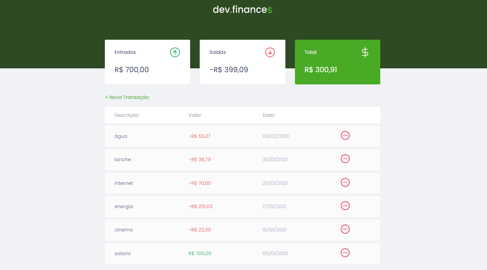

<h1 align="center"> dev.finance$ </h1>

 Um website para gerenciamento das finanças 

 
    <a href="#-sobre-o-projeto">Projeto</a>&nbsp;&nbsp;&nbsp;│&nbsp;&nbsp;&nbsp;
    <a href="#-tecnologias">Tecnologias</a>&nbsp;&nbsp;&nbsp;│&nbsp;&nbsp;&nbsp;
    <a href="#-features">Features</a>&nbsp;&nbsp;&nbsp;│&nbsp;&nbsp;&nbsp;
    <a href="#-licença">Licença</a>&nbsp;&nbsp;&nbsp;│&nbsp;&nbsp;&nbsp;
    <a href="#-dicas-para-usar-o-projeto">Dicas de uso</a>

 
    

 

 
    

### 💻 Sobre o projeto

O projeto é um website para o gerenciamento de transações financeiras pessoais. Permite aos usuários adicionar novas transações, categorizadas como entradas ou saídas, e fornece uma visão clara e atualizada do saldo total através de um painel intuitivo.

Tem como objetivo oferecer uma solução simples e eficaz para acompanhar as finanças do dia a dia, garantindo que todos os dados importantes estejam facilmente acessíveis e organizados. Ideal para quem busca uma forma rápida de manter o controle financeiro.

### 🚀 Tecnologias

Esse projeto foi desenvolvido com as seguintes tecnologias:

- HTML
- CSS
- JavaScript
- Git e Github
- Netlify

### 🚧 Features

- [x] Aula 1: Front-end
- [x] Aula 2: Finalização do HTML + CSS
- [x] Aula 3: Adicionando JavaScript e finalizando a aplicação
- [x] Organizar as transações por data
- [x] Publicar na Netlify

### 📜 Licença

Esse projeto está sob a licença MIT.

### 💡 Dicas para usar o projeto

Para conseguir visualizar a pagina é necessário utilizar a extensão "live server" pelo vscode.

---

Projeto feito através de uma aula da rocketseat. Alterado e adicionado algumas funcionalidades por KetCode.